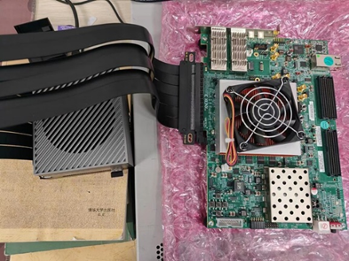

# PCIe 信号采集板卡Linux驱动

## 1.采集的信号类型

​     信号采集板卡由FPGA实现，FPGA接收的信号类型为Pulse Discreption Word(简写为：PDW) 每个PDW都具有时域、频域、空域、极化域、功率域及调制域等各维参数组成的信号特征参数向量，PDW 由接收机与测向处理机构成的参数测量系统给出。 当前绝大多数的无源探测设备均可提供五维 PDW，即由载频（CF）、脉宽（PW）、 脉幅（PA）、到达方向（DOA）、到达时间（TOA）组成的 PDW。

本信号采集板卡提供的PDW参数包括载频（CF）、脉宽（PW）和到达时间（TOA）其他的并不提供。

## 2.硬件链接

Jetson AGX Orin 和 FPGA VCU118 PCIe 通过PCIe扩展线连接，PCIe*16 扩展电缆（40cm），物理链接如下图所示

## 3.寄存器功能描述

该设备具有两个BARs, 其中BAR0包括一系列的控制寄存器, BAR1大小为4kB，提供内部存储。

BAR0寄存器表述表

| 偏移offset | 名称 name  | 默认值 Default Value | 权限(R/W) | 寄存器描述 Description                                   |
| ---------- | ---------- | -------------------- | --------- | -------------------------------------------------------- |
| 0x0        | ID         | 0xcafeaffe           | R         | 设备的ID 一般用来调试                                    |
| 0x4        | INVERT     | 0                    | R/W       | 翻转寄存器 将写入的数据取反后保存                        |
| 0x8        | IRQ CTRL   | 0                    | R/W       | 中断控制寄存器                                           |
| 0xc        | RANDOM VAL | 0                    | R         | 随机数寄存器 每次读取都得到一个随机数                    |
| 0x10       | DMA_SRC    | 0                    | R/W       | DMA传输源地址寄存器                                      |
| 0x18       | DMA_DST    | 0                    | R/W       | DMA传输目的地址寄存器                                    |
| 0x20       | DMA_CNT    | 0                    | R/W       | DMA传输长度寄存器                                        |
| 0x28       | DMA_CMD    | 0                    | R/W       | DMA传输指令寄存器,用来控制设备的DMA控制器                |
| 0x32       | PROCESS    | 0                    | R/W       | 设备运行状态寄存器，该寄存器用来反映和控制设备的运行状态 |

## 4.通信协议

PDW请求指令,数据帧传输方向 host to card

| 序号  | 名称         | 描述             | 缺省值 | 数据元素格式 | 数据元素长度 | 数据元素单位 | 值域        | 精度 |
| ----- | ------------ | ---------------- | ------ | ------------ | ------------ | ------------ | ----------- | ---- |
| 0     | 帧头         | 数据帧开始标志位 | 0xaa   | 无符号字符   | 1字节        | 无           | 无          | 无   |
| 1     | 指令类型     | PDW请求          | 01     | 无符号字符   | 1字节        | 无           | 无          | 无   |
| 2-5   | 监控时长     |                  | 00     | 无符号字符   | 4字节        | 毫秒(ms)     | 0-1000      | 无   |
| 6-9   | 监控起始频率 |                  | 00     | 无符号字符   | 4字节        | MHZ          | 2000-180000 | 无   |
| 10-13 | 监控结束频率 |                  | 00     | 无符号字符   | 4字节        | MHZ          | 2000-180000 | 无   |
| 14-17 | 保留         |                  | 00     | 无符号字符   | 4字节        | 无           | 无          | 无   |
| 18    | 帧尾         | 数据帧结束标志位 | 0xee   | 无符号字符   | 1字节        | 无           | 无          | 无   |

PDW回执指令 ,数据帧传输方向 card to host

| 序号  | 名称     | 描述                     | 缺省值 | 数据元素格式 | 数据元素长度 | 数据元素单位 | 值域        | 精度 |
| ----- | -------- | ------------------------ | ------ | ------------ | ------------ | ------------ | ----------- | ---- |
| 0     | 帧头     | 数据帧开始标志位         | 0xbb   | 无符号字符   | 1字节        | 无           | 无          | 无   |
| 1     | 指令类型 | PDW数据回执              | 02     | 无符号字符   | 1字节        | 无           | 无          | 无   |
| 2-3   | PDW编号  | 一批PDW中该PDW是第多少个 | 00     | 无符号字符   | 2字节        | 无           | 0-1000      | 无   |
| 4-11  | TOA      | 到达时间                 | 00     | 无符号字符   | 8字节        | us           | 无          | 无   |
| 12-15 | CF       | 载频                     | 00     | 无符号字符   | 4字节        | MHZ          | 2000-180000 | 无   |
| 16-19 | PW       | 脉宽                     | 00     | 无符号字符   | 4字节        | us           | 无          | 无   |
| 20    | 帧尾     | 数据帧结束标志位         | 0xdd   | 无符号字符   | 1字节        | 无           | 无          | 无   |

## 5.提供软件仿真

为了减少联调成本，前期使用基于QEMU模拟PCIe设备的功能来手动模拟出一个PCIe设备。注意该设备生成的PDW信号无实际意义，无法进行后续信号处理，仅能用于调试驱动功能。

## 6.如何使用该驱动

TODO

